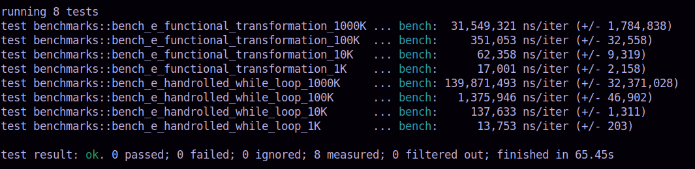

#### Calculation of epsilon

Here, I have used the benchmarking crate `bencher` which - going by its own repo page, is not stable at all. Still I 
have decided to use it, to have a feel of how the code has to be structured in order to benchmarked and how other 
tools like `criterion` or `divan` makes the task of benchmarking much better and easier.

`bencher` makes use of testing facility of Rust programs. The benchmarking driver functions reside inside a `#cfg
[test]` boundary. `Cargo` is instructed to run the tests.

##### How to run

For running `Bencher` based suits, _Rust nightly_ is required. `catgo-toolchain.toml` is set up to ensure this.
The directory structure is:

.

- Move to this directory (./naturall-e)
- Execute `rustup run nightly cargo bench` at the prompt
- Expect output like the following:

.

The `benches` directory is empty. It is kept here to keep the directory structures which use other benchmarking 
tools in this experiment, equivalent.
