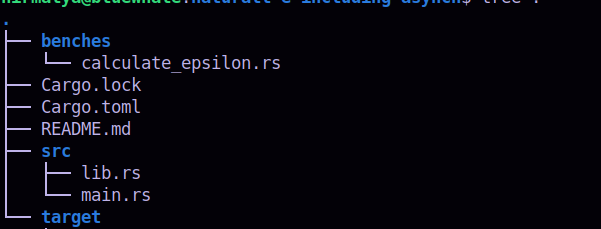
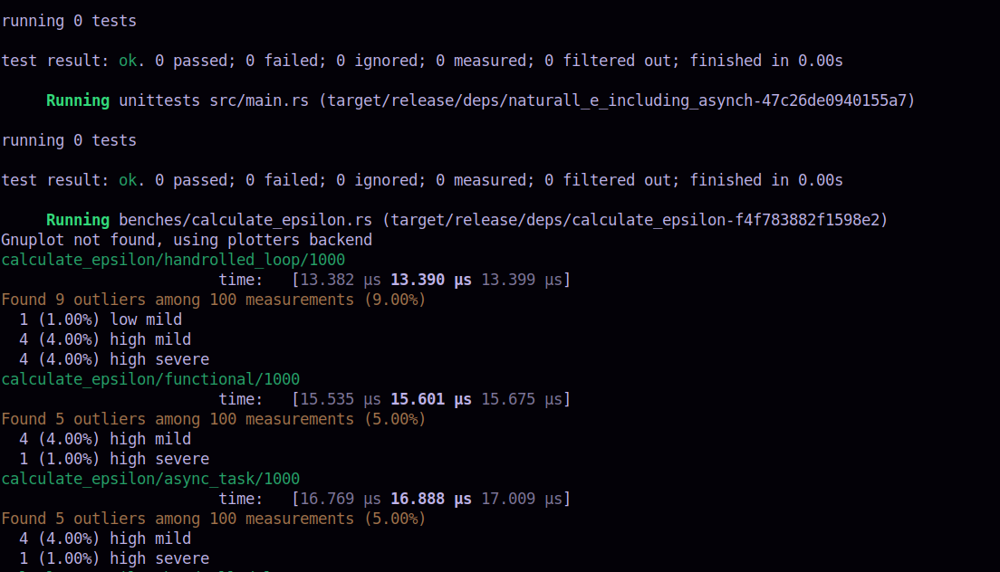
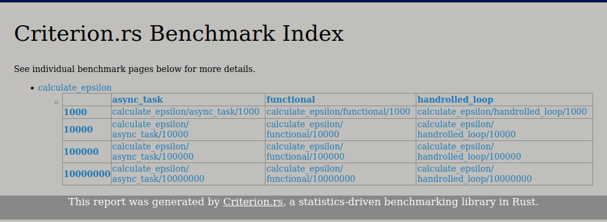

#### Calculation of epsilon

Even though Criterion's documentation cautions about the possible incorrect readings when used for measuring 
asynchronous functions, I decide to use this feature. My aim is to subject the computation to asynchronous 
arrangement that tokio provides and observe how much its performance differs from the performance of rayon's 
parallelization meant for CPU-bound computation.

##### Criterion's `group` facility

Criterion allows grouping functions - all of which are being measured -  together. In effect, the act of passing 
same inputs to the functions is straightforward. Moreover, the comparison of their performance becomes easier to 
prepare and analyse (by using Criterion's Reports).

I make use of Macros provided by Criterion to create, run and complete the group.

##### Criterion's requirement of an Executor

The `bencher` can be moulded into an `asynchronous bencher` by providing it with an `AsyncExecutor`. Tokio's 
`Runtime` is one such:

```rust
    let runtime = 
        tokio::runtime::Builder::new_multi_thread()
        .enable_all()
        .thread_name("benchmark-thread")
        .worker_threads(MX_TASKS)
        .build()
        .expect("Creating Tokio runtime");
    // ...
    b.to_async(&runtime).iter(|| calculate_e_scatter_gather_internal(*s));
```

#####   How to run

The directory structure is:
.

-   Move to this directory (./naturall-e-including-asynch)
  - Execute `cargo bench` at the $ prompt
  - During the benchmarking, output like below appears:
    .

  - Once the benchmarking is complete, using the browser, open the following HTML report:
    {current_directory}/target/criterion/report/index.html
  - The report's first page looks like this:
    .

