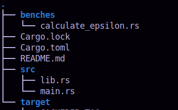
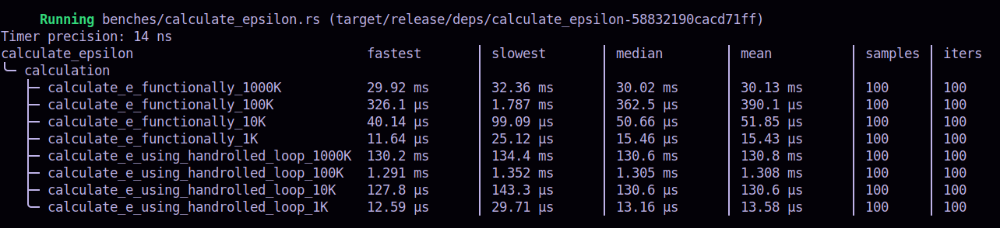

#### Calculation of epsilon

I have come across _Divan_ while reading about the tools to measure performance of Rust functions.  Its aim is to make
measurement of performance and interpretation of the result, easier than those of Criterion.

In this exercise, I don't delve much into the facilities of _Divan_. The results are well-formatted. May be, going 
deeper into its facilities will be useful, especially if we want to measure the memory consumption etc.

##### How to run

The directory structure is:
.

- Move to this directory (./naturall-e-divan)
- Execute `cargo bench` at the prompt
- Expect output like the following:

.
